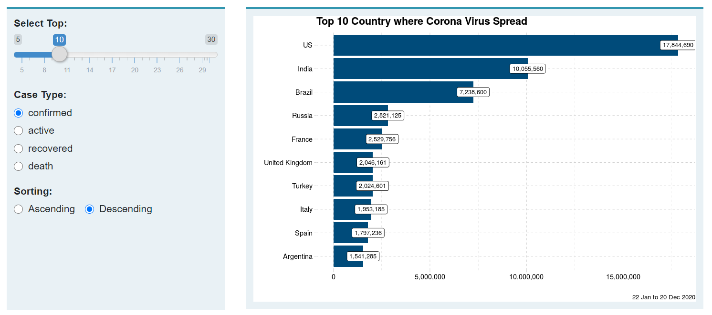
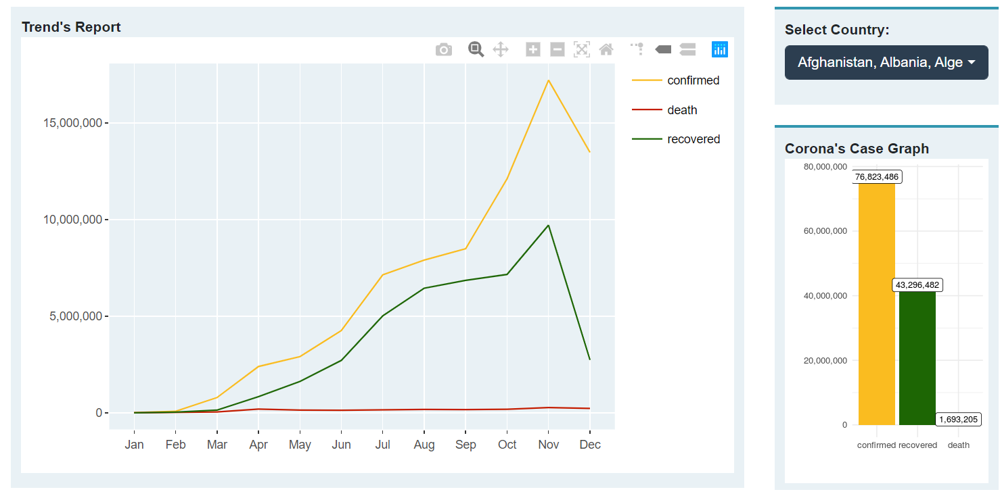
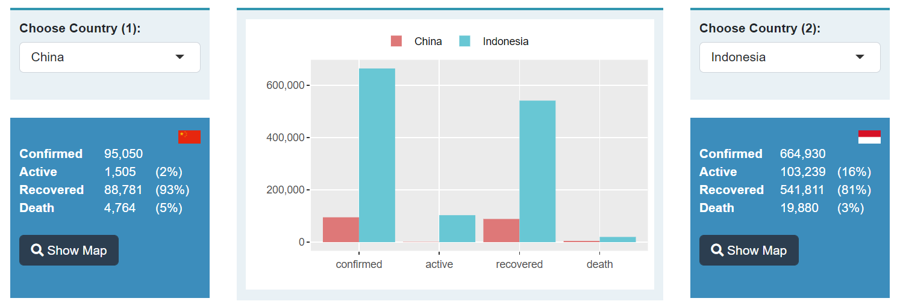
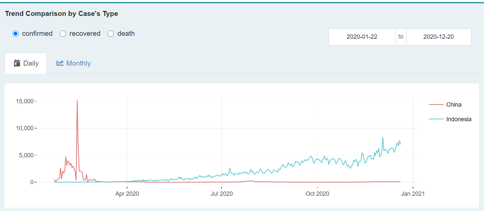

# Covid Dashboard
This is repository of my first project, Covid Dashboard, which will help you to keep updated the information about Corona Virus arround the world. This dashboard inform you about:
1. Countries status which is struggling facing corona virus, so you can be prepared when you must go abroad.
2. Top country which have the most confirm case.
3. The Trend of confirm, active, recovered and death cases arround the world.
4. Comparison between two countries. You can compairing your country with others and see the result!

## Library
This dashboard is devoloped by using `R Languange` and some libraries i.e `shiny`,`shinydashboard`,`shinydashboardPlus`,`shinythemes`,`shinyWidgets`,`dashboardthemes`,`ggplot2`,`plotly`,`leaflet ` and more. You can check all libraries in `global.r`

## Dataset
The Corona Virus Dataset pulled from [Rami Krispin's Github](https://github.com/RamiKrispin/coronavirus). Thanks pal @RamiKrispin !

## Dashboard
This dashboard page show  total confirm case, active case, recover and death case in the`valueBox`. The map on this page show the countries status and case for every country in the world, so you can well prepare when you must go abroad. This map using `leaflet` library.

## Top Spreading
In this page, you can see where the most case was happened. You can filter it by cases type like confirm, active, recovered and death.

## Trend
This page will show you the trend of confirm, active, recovered and death cases arround the world. You can filter it by multiple countries.

## Comparison
In this page you can comparing your country with the others so you can check how good (or bad) your government handle this pandemic and how obidient your people to obey the rules. You can also see the daily and monthly trend between two countries. 

**Trend's plot:**

**Show Mini Map**

## Shinyapps
For further information, you can check my prohect in [Covid Dashboard](https://nugroho.shinyapps.io/covid/)

