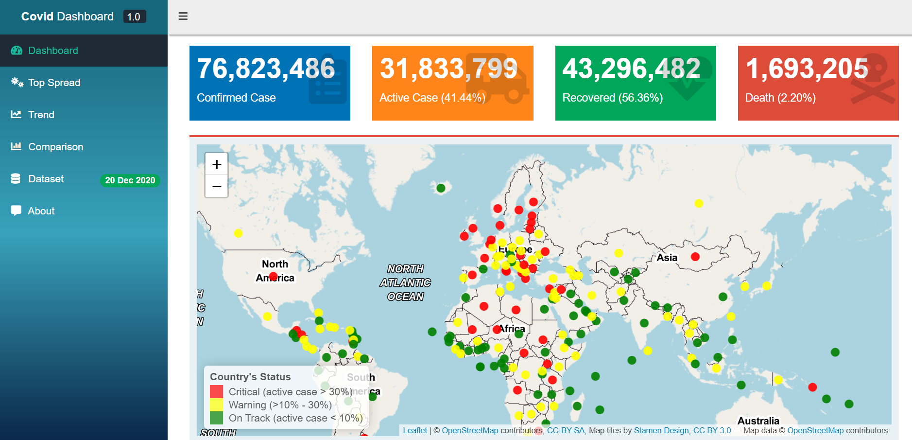

# Covid Dashboard
This is repository of my first project, Covid Dashboard, which will help you to keep updated the information about Corona Virus arround the world. This dashboard inform you about:
1. Countries status which is struggling facing corona virus, so you can be prepared when you must go abroad.
2. Top country which have the most confirm case.
3. The Trend of confirm, active, recovered and death cases arround the world.
4. Comparison between two countries. You can compairing your country with others and see the result!

## Library
This dashboard is devoloped by using `R Languange` and some libraries i.e `shiny`,`shinydashboard`,`shinydashboardPlus`,`shinythemes`,`shinyWidgets`,`dashboardthemes`,`ggplot2`,`plotly`,`leaflet ` and more. You can chek all libraries in `global.r`

## Map
![dashboard_img]
